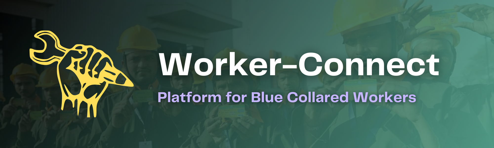

<a name="readme-top"></a>

[![Contributors][contributors-shield]][contributors-url]
[![Forks][forks-shield]][forks-url]
[![Stargazers][stars-shield]][stars-url]
[![Issues][issues-shield]][issues-url]
[![LinkedIn][linkedin-shield]][linkedin-url]

<!-- PROJECT LOGO -->
<br/>
<div align="center">
  <a href="https://github.com/Devang2304/WorkerConnect">
    
  </a>
    <br>
    <br>

  <h3 align="center"><b>WorkerConnect</b></h3>

  <p align="center">
    WorkerConnect is a comprehensive platform designed to bridge the gap between blue-collar workers and individuals in need of their services. 
    <br />
    <br>
    <a href="https://github.com/Devang2304/WorkerConnect"><strong>Explore the docs »</strong></a>
    <br />
    <a href="https://github.com/Devang2304/WorkerConnect">View Demo</a>
  </p>
</div>

<!-- ABOUT THE PROJECT -->
<br>

## ♾️ About The Project

WorkerConnect is a comprehensive platform designed to bridge the gap between blue-collar workers and individuals in need of their services. The project offers a user-friendly web application where workers can list their services, showcase their skills through images, and connect with potential clients. The platform includes a price negotiation system and encompasses three key sides: the admin side, worker side, and client side.

On the admin side, the platform ensures the authenticity and quality of workers by approving them based on their skills and identity verification. This step ensures that clients can trust the workers listed on the platform, fostering a reliable and secure environment for both parties involved.

The worker side of WorkerConnect empowers blue-collar workers to showcase their skills and services. Workers can create profiles, add images of their previous work, and highlight their expertise, enabling clients to assess their capabilities. By providing a platform for workers to display their skills, WorkerConnect opens up opportunities for them to connect with a broader client base and expand their professional network.

On the client side, individuals seeking blue-collar services can post job requirements on the platform. Clients can provide details about the work they need to be done, including job descriptions, location, and other relevant information. Workers registered on the platform can then apply for the posted jobs, demonstrating their interest and availability. This streamlined process facilitates efficient communication between clients and workers, ensuring a smooth hiring experience.

WorkerConnect incorporates a price negotiation system to promote fair and transparent transactions. Clients and workers can discuss and negotiate the pricing terms within the platform, fostering a mutually agreed-upon arrangement. This feature encourages open communication and flexibility, ensuring both parties are satisfied with the financial aspects of the service.

The web application is built using the MERN stack, which comprises MongoDB, Express.js, React.js, and Node.js. This technology stack provides a robust and scalable foundation for the platform, enabling efficient data storage, server-side processing, and dynamic user interfaces. The MERN stack ensures a seamless user experience, facilitating smooth interactions between workers, clients, and the platform.

WorkerConnect aims to empower blue-collar workers by providing them with a digital platform to showcase their skills, connect with potential clients, and expand their professional opportunities. Simultaneously, the project offers clients a convenient and reliable way to find skilled workers for their specific job requirements. With its user-friendly interface and comprehensive features, WorkerConnect contributes to fostering a collaborative and efficient ecosystem for blue-collar services.

<p align="right">(<a href="#readme-top">back to top</a>)</p>

## ⚙️ Built With

The technologies and tools used are:

- [![HTML][html]][html-url]
- [![CSS][css]][css-url]
- [![JavaScript][js]][js-url]
- [![MongoDB][mongodb]][mongodb-url]
- [![ExpressJS][express]][express-url]
- [![NodeJS][node]][node-url]

<p align="right">(<a href="#readme-top">back to top</a>)</p>

<!-- GETTING STARTED -->

## 🧑‍💻 Getting Started

Follow the below steps to set up the project locally:

### Prerequisites

You need to setup you MongoDB Clusters priorly and then follow the steps.

### Installation

1. Clone the repository

   ```sh
   git clone https://github.com/Devang2304/WorkerConnect.git
   ```

2. Install the dependencies:

   ```sh
   npm i
   ```

<p align="right">(<a href="#readme-top">back to top</a>)</p>

## 💡 Features

<br>

- Price Negotiation System
- Notification System
- Add Tasks
- Worker Profile with Ratings

<p align="right">(<a href="#readme-top">back to top</a>)</p>

<!-- ROADMAP -->

## 🛣️ Roadmap

- [x] Price Negotiation System
- [x] Notification System
- [x] Add Tasks
- [x] Worker Profile with Ratings

<p align="right">(<a href="#readme-top">back to top</a>)</p>

<!-- CONTACT -->

## 📧 Contact

Devang Vartak - [@devang230403](https://www.linkedin.com/in/devang230403/) - devangvartak2304@gmail.com

Project Link: [https://github.com/Devang2304/WorkerConnect](https://github.com/Devang2304/WorkerConnect)

<p align="right">(<a href="#readme-top">back to top</a>)</p>

## ✨ Contributors

Thanks go to these wonderful people:

- [Devang Vartak](https://github.com/Devang2304/)
- [Shubham More](https://github.com/Shubhamore/)
- [Swastik Verma](https://github.com/SwastikVerma/)
- [Rohit Phalke](https://github.com/Rohit-1001/)

[contributors-shield]: https://img.shields.io/github/contributors/Devang2304/WorkerConnect.svg?style=for-the-badge
[contributors-url]: https://github.com/Devang2304/WorkerConnect/graphs/contributors
[forks-shield]: https://img.shields.io/github/forks/Devang2304/WorkerConnect.svg?style=for-the-badge
[forks-url]: https://github.com/Devang2304/WorkerConnect/network/members
[stars-shield]: https://img.shields.io/github/stars/Devang2304/WorkerConnect.svg?style=for-the-badge
[stars-url]: https://github.com/Devang2304/WorkerConnect/stargazers
[issues-shield]: https://img.shields.io/github/issues/Devang2304/WorkerConnect.svg?style=for-the-badge
[issues-url]: https://github.com/Devang2304/WorkerConnect/issues
[license-shield]: https://img.shields.io/github/license/Devang2304/WorkerConnect.svg?style=for-the-badge
[license-url]: https://github.com/Devang2304/WorkerConnect/blob/master/LICENSE.txt
[linkedin-shield]: https://img.shields.io/badge/-LinkedIn-black.svg?style=for-the-badge&logo=linkedin&colorB=555
[linkedin-url]: https://linkedin.com/in/devang230403
[html]: https://img.shields.io/badge/HTML-20232A?style=for-the-badge&logo=html5&logoColor=61DAFB
[html-url]: https://developer.mozilla.org/en-US/docs/Web/HTML
[css]: https://img.shields.io/badge/Css-000000?style=for-the-badge&logo=css3&logoColor=white
[css-url]: https://developer.mozilla.org/en-US/docs/Web/CSS
[js]: https://img.shields.io/badge/Javscript-0769AD?style=for-the-badge&logo=javascript&logoColor=white
[js-url]: https://developer.mozilla.org/en-US/docs/Web/javascript
[mongodb]: https://img.shields.io/badge/mongodb-20232A?style=for-the-badge&logo=mongodb&logoColor=61DAFB
[mongodb-url]: https://www.mongodb.com/docs/
[express]: https://img.shields.io/badge/expressjs-000000?style=for-the-badge&logo=express&logoColor=white
[express-url]: https://expressjs.com/
[node]: https://img.shields.io/badge/NodeJS-0769AD?style=for-the-badge&logo=node.js&logoColor=white
[node-url]: https://nodejs.org/en/docs
